In the algorithms presented in Section~4 of Venkovic and Anzt (2025), for any given $x\in\mathbb{C}^n$, we need to evaluate $A_{r,n}x$, $\overline{A_{r,n}}x$ and $A_{r,n}^Tx$.
Irrespective of the radix, these kernels are implemented as described in Algos.~1 and 2.
In what follows, we show detailed implementations of these kernels for radices 2, 4, and 8.  

  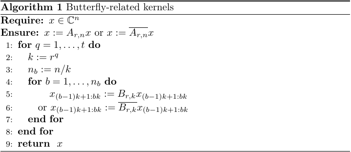

  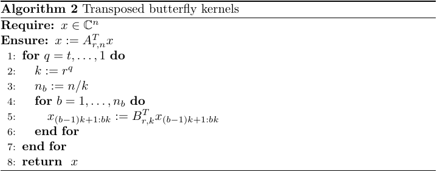

## Radix-2 butterfly-related kernels

For the radix-2 case, we have

$$
B_{2,k}=
(F_2\otimes I_{k/2})\text{diag}\left(I_{k/2},\Omega_{2,k/2}\right)
$$

where 

$$
F_2=\begin{bmatrix}1& 1\\1&-1\end{bmatrix}
$$

so that
$B_{2,k}=
\begin{bmatrix}
I_{k/2} &  \Omega_{2,k/2}\\
I_{k/2} & -\Omega_{2,k/2}
\end{bmatrix}$.\\
Then, for all $x\in\mathbb{C}^k$, as we let $z_i:=x_{(i-1)k/2+1:ik/2}$ for $i=1,2$, we obtain
$$
\begin{align}
B_{2,k}x=&\,
\begin{bmatrix}
z_{1}+\Omega_{2,k/2}z_{2}\\
z_{1}-\Omega_{2,k/2}z_{2}\\
\end{bmatrix}.
\end{align}
$$
We then let $\tau:=\Omega_{2,k/2}z_{2}$ so that
$$
\begin{align}
B_{2,k}x=&\,
\begin{bmatrix}
z_{1}+\tau\\
z_{1}-\tau
\end{bmatrix}.
\end{align}
$$
This leads to Algo.~\ref{alg:butterfly-kernel-radix-2} for the computation of $x\mapsto A_{2,n}x$.  

  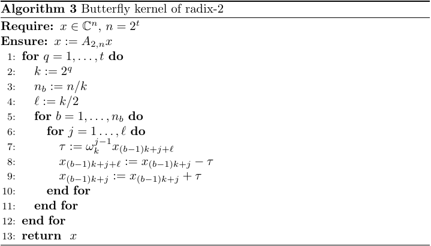

The radix-2 conjugate butterfly kernel relies on the expression
$$
\begin{align}
\overline{B_{2,k}}x=&\,
\begin{bmatrix}
z_{1}+\overline{\Omega_{2,k/2}}z_{2}\\
z_{1}-\overline{\Omega_{2,k/2}}z_{2}\\
\end{bmatrix}
\end{align}
$$
so that, as we let $\tau:=\overline{\Omega_{2,k/2}}z_{2}$, we still have
$$
\begin{align}
\overline{B_{2,k}}x=&\,
\begin{bmatrix}
z_{1}+\tau\\
z_{1}-\tau
\end{bmatrix}.
\end{align}
$$
This leads to Algo.~\ref{alg:conjugate-butterfly-kernel-radix-2} for the computation of $x\mapsto\overline{A_{2,n}}x$.  

  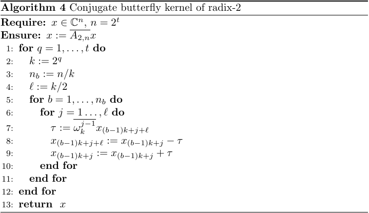

n the other hand, we also have
$$
\begin{align}
B_{2,k}^Tx=
\begin{bmatrix}
z_{1}+z_{2}\hfill\\
\Omega_{2,k/2}z_{1}-\Omega_{2,k/2}z_{2}
\end{bmatrix}
\end{align}
$$
so that if we let $\tau:=z_2$, we obtain
$$
\begin{align}
B_{2,k}^Tx=
\begin{bmatrix}
z_{1}+\tau\hfill\\
\Omega_{2,k/2}(z_{1}-\tau)
\end{bmatrix}.
\end{align}
$$
This leads to Algo.~\ref{alg:transposed-butterfly-kernel-radix-2} for the computation of $x\mapsto A_{2,n}^Tx$.  

  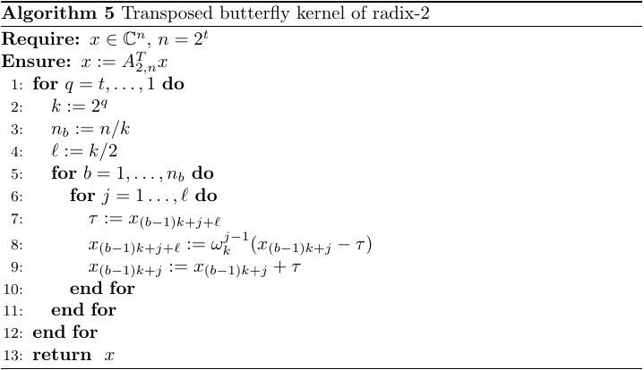

## Radix-4 butterfly-related kernels
For the radix-4 case, we have
$$
\begin{align}
B_{4,k}=
(F_4\otimes I_{k/4})\,\text{diag}\left(I_{k/4},\Omega_{4,k/4},\Omega_{4,k/4}^2,\Omega_{4,k/4}^3\right)
\end{align}
$$
where
$$
\begin{align}
F_4=
\begin{bmatrix}
1& 1& 1& 1\\
1&-i&-1& i\\
1&-1& 1&-1\\
1& i&-1&-i
\end{bmatrix}
\end{align}
$$
so that
$$
\begin{align}
B_{4,k}=
\begin{bmatrix}
I_{k/4}&       \Omega_{4,k/4}& \Omega_{4,k/4}^2&       \Omega_{4,k/4}^3\\
I_{k/4}&-i\cdot\Omega_{4,k/4}&-\Omega_{4,k/4}^2& i\cdot\Omega_{4,k/4}^3\\
I_{k/4}&      -\Omega_{4,k/4}& \Omega_{4,k/4}^2&      -\Omega_{4,k/4}^3\\
I_{k/4}& i\cdot\Omega_{4,k/4}&-\Omega_{4,k/4}^2&-i\cdot\Omega_{4,k/4}^3
\end{bmatrix}.
\end{align}
$$
Then, for all $x\in\mathbb{C}^k$, as we let $z_i:=x_{(i-1)k/4+1:ik/4}$ for $i=1,\dots,4$, we obtain
$$
\begin{align}
B_{4,k}x=&\,
\begin{bmatrix}
z_{1}+\Omega_{4,k/4}z_{2}+\Omega_{4,k/4}^2z_{3}+\Omega_{4,k/4}^3z_{4}\hfill\\
z_{1}-i\cdot\Omega_{4,k/4}z_{2}-\Omega_{4,k/4}^2z_{3}+i\cdot\Omega_{4,k/4}^3z_{4}\\
z_{1}-\Omega_{4,k/4}z_{2}+\Omega_{4,k/4}^2z_{3}-\Omega_{4,k/4}^3z_{4}\hfill\\
z_{1}+i\cdot\Omega_{4,k/4}z_{2}-\Omega_{4,k/4}^2z_{3}-i\cdot\Omega_{4,k/4}^3z_{4}\hfill
\end{bmatrix}.
\end{align}
$$
Once we introduce
$$
\begin{align}
&\tau_1:=z_1+\Omega_{4,k/4}^2z_3,\hspace{1.02cm}
\tau_2:=z_1-\Omega_{4,k/4}^2z_3\\
&\tau_3:=\Omega_{4,k/4}z_2+\Omega_{4,k/4}^3z_4,\;\;
\tau_4:=\Omega_{4,k/4}z_2-\Omega_{4,k/4}^3z_4\nonumber
\end{align}
$$
we get
$$
\begin{align}
B_{4,k}x=&\,
\begin{bmatrix}
\tau_1+\tau_3\\
\tau_2-i\cdot\tau_4\\
\tau_1-\tau_3\hfill\\
\tau_2+i\cdot\tau_4\hfill
\end{bmatrix}.
\end{align}
$$
This leads to Algo.~\ref{alg:butterfly-kernel-radix-4} for the computation of $x\mapsto A_{4,n}x$.  

  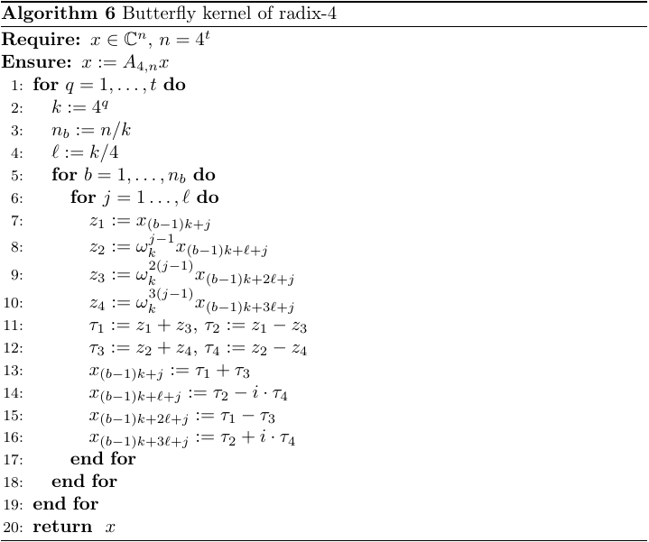

  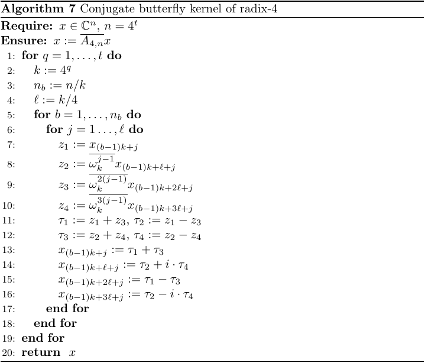

  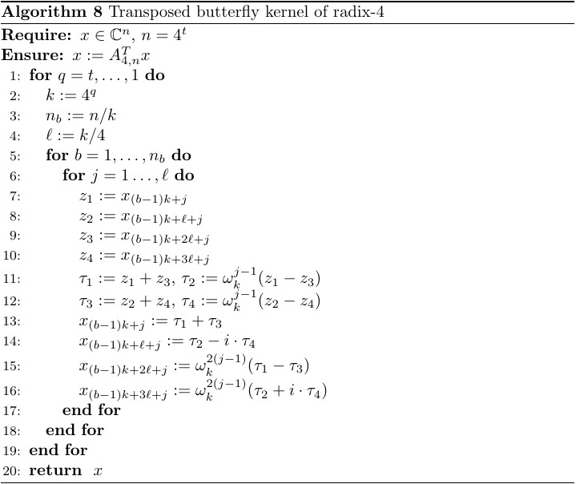

  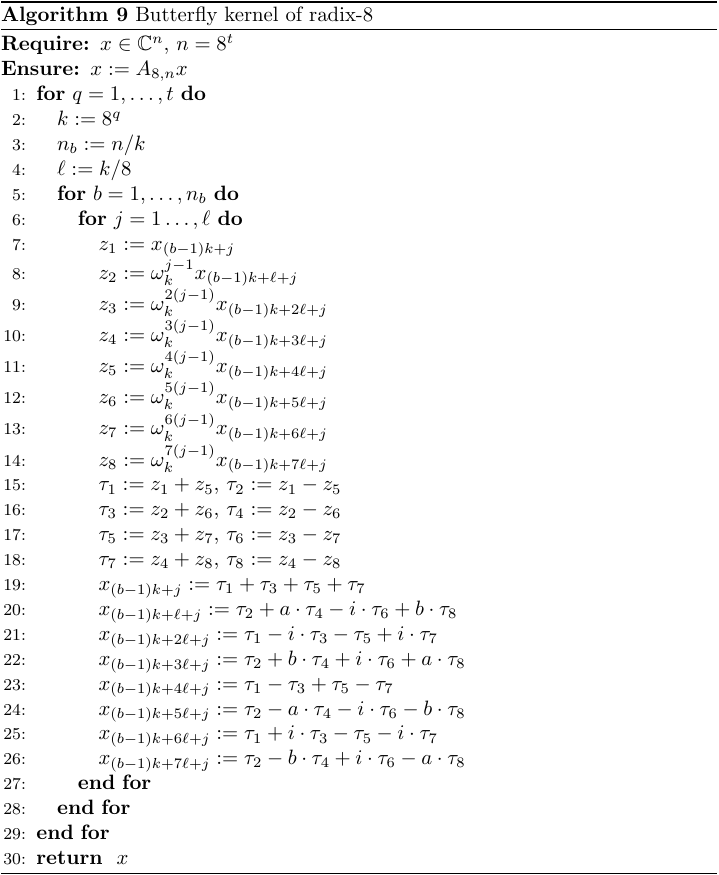

  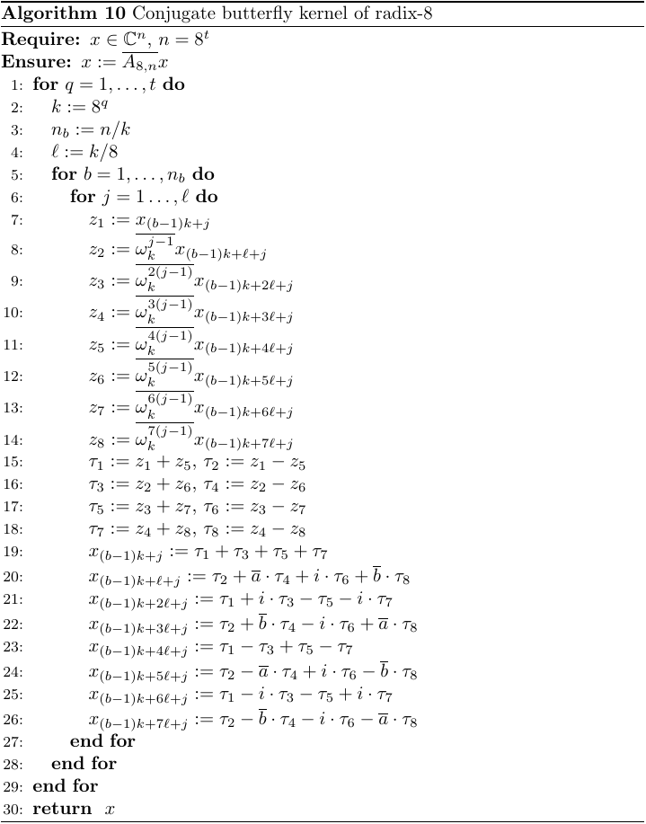

  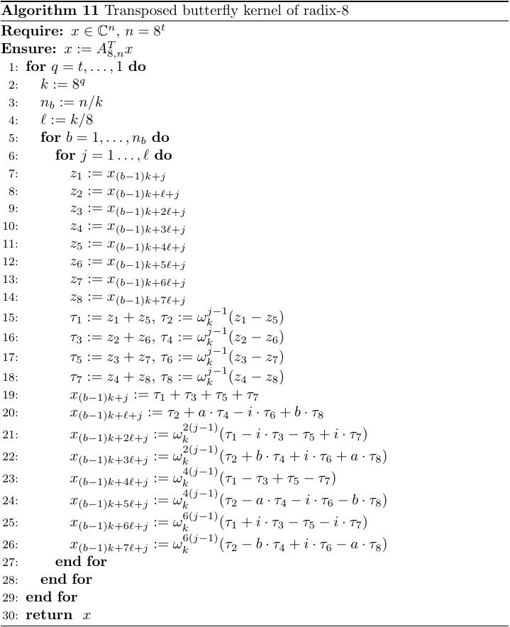

N. Venkovic and H. Anzt ,(2025). Permutation-avoiding FFT-based convolution. arXiv preprint, arXiv:12506.12718.